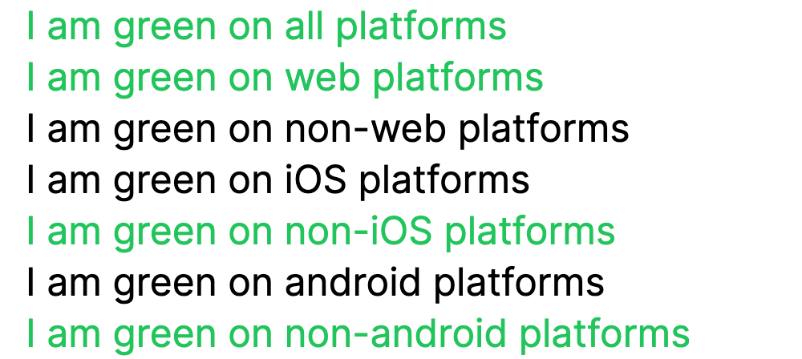
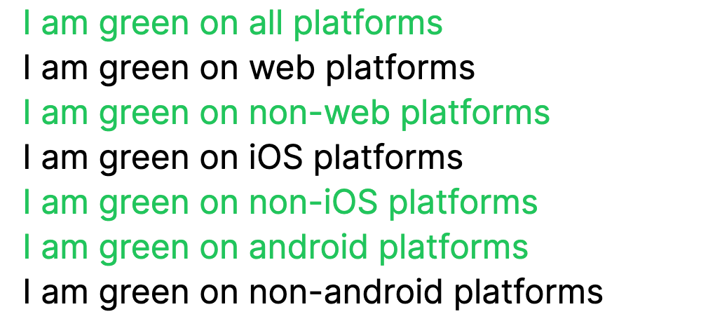
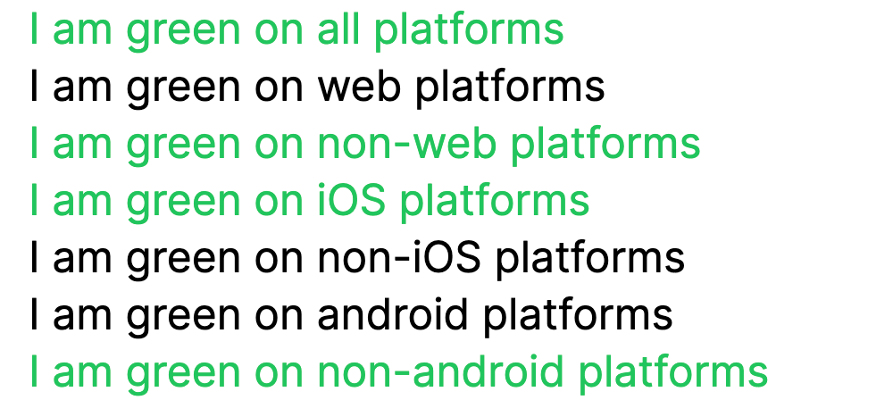

# tailwindcss-turbo-native

A plugin for Tailwind CSS v3.0+ that provides utilities for handling turbo-native applications.

## Installation

Install the plugin from npm:

```sh
npm install tailwindcss-turbo-native
```

Or if using import maps in Rails 7+:

```sh
bin/importmap pin tailwindcss-turbo-native
```

### Tailwind

Then add the plugin to your `tailwind.config.js` file:

```js
// tailwind.config.js
module.exports = {
  theme: {
    // ...
  },
  plugins: [
    require('tailwindcss-turbo-native'),
    // ...
  ],
}
```

### Rails

Your `application.html.erb` should conditionally render your chosen data tags to the page's html tag:

```erb
<html
  <%= 'data-turbo-native-android' if turbo_native_android_app? %>
  <%= 'data-turbo-native-ios' if turbo_native_ios_app? %>
>
```

The following helpers should also be added to a `app/helpers/turbo_native_helper.rb` file. The exact regex matching for iOS is configured by default, you might need to explicitly configure your iOS app to explicitly add `Turbo Native iOS` to the application's userAgent.

```ruby
module TurboNativeHelper
  def turbo_native_ios_app?
    request.user_agent.to_s.match?(/Turbo Native iOS/)
  end

  def turbo_native_android_app?
    request.user_agent.to_s.match?(/Turbo Native Android/)
  end
end
```

### iOS

For example by using the following `WKWebViewConfiguration`

```swift
import Foundation
import WebKit

enum WebViewPool {
    static var shared = WKProcessPool()
}

extension WKWebViewConfiguration {
    static var appConfiguration: WKWebViewConfiguration {
        let userAgent = "Turbo Native iOS"

        let configuration = WKWebViewConfiguration()
        configuration.processPool = WebViewPool.shared
        configuration.applicationNameForUserAgent = userAgent
        configuration.defaultWebpagePreferences?.preferredContentMode = .mobile

        return configuration
    }
}
```

### Android

Android turbo native apps already include the `Turbo Native Android` in their userAgents so no additional configuration should be neccesary.

## Usage

The following body would render differently in each of the preceding HTML tags.

```html
<h2 class="text-green-500">I am green on all platforms</h2>
<h2 class="web:text-green-500">I am green on web platforms</h2>
<h2 class="not-web:text-green-500">I am green on non-web platforms</h2>
<h2 class="ios:text-green-500">I am green on iOS platforms</h2>
<h2 class="not-ios:text-green-500">I am green on non-iOS platforms</h2>
<h2 class="android:text-green-500">I am green on android platforms</h2>
<h2 class="not-android:text-green-500">I am green on non-android platforms</h2>
```

### Web

```html
<html>
  <!-- # No additional attribute gets applied to the html tag-->
  <h2 class="text-green-500">I am green on all platforms</h2>
  <h2 class="web:text-green-500">I am green on web platforms</h2>
  <h2 class="not-web:text-green-500">I am green on non-web platforms</h2>
  <h2 class="ios:text-green-500">I am green on iOS platforms</h2>
  <h2 class="not-ios:text-green-500">I am green on non-iOS platforms</h2>
  <h2 class="android:text-green-500">I am green on android platforms</h2>
  <h2 class="not-android:text-green-500">I am green on non-android platforms</h2>
</html>
```



### Android

```html
<html data-turbo-native-android>
  <h2 class="text-green-500">I am green on all platforms</h2>
  <h2 class="web:text-green-500">I am green on web platforms</h2>
  <h2 class="not-web:text-green-500">I am green on non-web platforms</h2>
  <h2 class="ios:text-green-500">I am green on iOS platforms</h2>
  <h2 class="not-ios:text-green-500">I am green on non-iOS platforms</h2>
  <h2 class="android:text-green-500">I am green on android platforms</h2>
  <h2 class="not-android:text-green-500">I am green on non-android platforms</h2>
</html>
```



### iOS

```html
<html data-turbo-native-ios>
  <h2 class="text-green-500">I am green on all platforms</h2>
  <h2 class="web:text-green-500">I am green on web platforms</h2>
  <h2 class="not-web:text-green-500">I am green on non-web platforms</h2>
  <h2 class="ios:text-green-500">I am green on iOS platforms</h2>
  <h2 class="not-ios:text-green-500">I am green on non-iOS platforms</h2>
  <h2 class="android:text-green-500">I am green on android platforms</h2>
  <h2 class="not-android:text-green-500">I am green on non-android platforms</h2>
</html>
```



## Configuration

By default we ship with the following configured values:

```json
"turboNativeCustomDataAttributes": {
    "android": "data-turbo-native-android",
    "ios": "data-turbo-native-ios"
}
```

| Configuration Variable                    | Default Value               | Info                                                                                          |
| ----------------------------------------- | --------------------------- | --------------------------------------------------------------------------------------------- |
| `turboNativeCustomDataAttributes.android` | `data-turbo-native-android` | `Configures the data attribute that should be applied to your HTML tag for android rendering` |
| `turboNativeCustomDataAttributes.ios`     | `data-turbo-native-ios`     | `Configures the data attribute that should be applied to your HTML tag for iOS rendering`     |

You can configure which data attributes you use to for dynamic rendering in your turbo native application by editing your `tailwind.config.js` file:

```js
// tailwind.config.js
module.exports = {
  theme: {
    extend: {
      turboNativeCustomDataAttributes: {
        ios: 'data-android',
        android: 'data-ios',
      },
    },
  },
}
```

This override would require you to render your markup as follows for Web, iOS, and Android.

### Web

```html
<html>
  <!-- # No additional attribute -->
  <!-- rest of your markup to abide by tailwindcss-turbo-native rules  -->
</html>
```

### iOS

```html
<html data-ios>
  <!-- rest of your markup to abide by tailwindcss-turbo-native rules where iOS is rendered  -->
</html>
```

### Android

```html
<html data-android>
  <!-- rest of your markup to abide by tailwindcss-turbo-native rules where android is rendered -->
</html>
```
